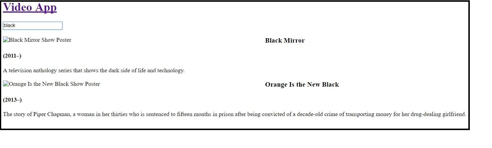

# React-Video-App

## Description
This is a log of me writing a Video App in React and what components I'm adding.

# How to Use
You can reach the landing page with this link:
https://devapalasingam.github.io/React-Video-App/#/

The search bar on the landing page isn't functional at the moment. If you click "or Browse All" you'll get a list of all the TV shows in the data.json. If you type something in the search bar, the screen will real-time-update with the shows that match what you type.

You can see specific details on each show with this link:
https://devapalasingam.github.io/React-Video-App/#/details/tt0903747
Just replace the last part with the imdbID found in the data.json.

# Day 1
### -Initial commit
### -Added routing for Landing page, Search page, and 404 page
### -Search page shows all shows

# Day 2
### -Made ShowCard Component
### -Added images and descriptions for each show
### -Can now type in search bar
### -Added search filter

Need to figure out why images don't show and why ShowCard can't find styled-components

# Day 3
### -Added routing for details page
### -Added trailers in each details page
### -Turned Header into component
### -Clicking on Header takes back to landing page
### -Added Api to randomly generate ratings
### -Added loading spinner to run while waiting for rating API

Need to figure out how to fix API to run
Need to figure out why images don't show and why ShowCard can't find styled-components

